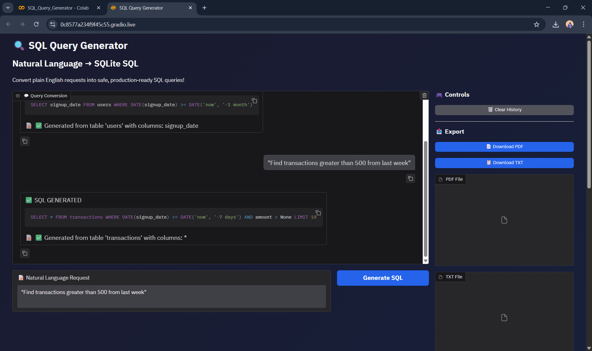

# SQL Query Generator

## Description

This project converts natural language queries into SQL queries using Python and Natural Language Processing.

## Technologies Used

* Python
* NLP
* Google Colab
* Gradio

## Project Demo

## How to Run

1. Open the notebook in Google Colab
2. Run all cells
3. Enter a natural language query
4. The system will generate the SQL query

## Open in Google Colab

https://colab.research.google.com/github/yogeshwaranrajkumar28/SQL_Query_Generator/blob/main/SQL_Query_Generator.ipynb
